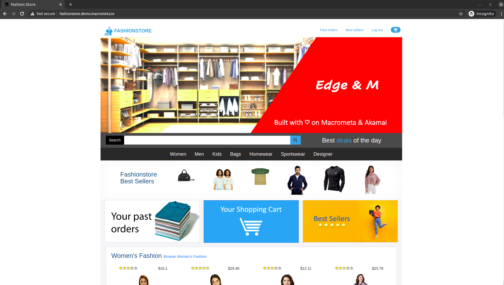

# Macrometa Akamai e-commerce template app

# Play with a live demo 👇

http://fashionstore.demo.macrometa.io/



Macrometa-Akamai Fashionstore Demo App is a full-stack e-commerce web application that creates a storefront (and backend) for customers to shop for "fictitious" fashion clothing & accessories. Originally based on the AWS bookstore template app (https://github.com/aws-samples/aws-bookstore-demo-app), this demo replaces all AWS services like DynamoDB, Neptune, elastic search, lambda etc with Macrometa's geo distributed data platform which provides a K/V store, DynamoDB compatible document database, graph database, streams and event processing along with Akamai workers for the globally distributed functions as a service.

Unlike typical cloud platforms like AWS where the backend stack runs in a single region, Macrometa and Akamai let you build stateful distributed microservices that run in 100s of regions around the world concurrently. The application logic runs in akamai's low latency function as a service runtime on akamai PoPs and make stateful data requests to the closest Macrometa region. End to end latency for P90 is < 55ms from almost everywhere in the world.

As a user of the demo- You can browse and search for fashion clothing & accessories, look at recommendations and best sellers, manage your cart, checkout, view your orders, and more.

## Macrometa components

# 1. Product catalog/shopping cart - implemented using Macrometa document database

```
FashionItemsTable - collection of the available fashion clothing & accessories.
CartTable - Fashion items customers have addded in their cart
OrdersTable - Past orders of a customer
```

# 2. Search - implemented using Macrometa Views

```
findFashionItems - the view which is queried for search
```

Search matches on the `category` or the `name` of fashion item in `FashionItemsTable` with phrase matching

# 3. Recommendations - implemented using Macrometa graphs

```
friend - edge collection
purchased - edge collection
UsersTable - vertex collection
FashionItemsTable vertex collection
UserSocialGraph - Graph
```

# 4. Top sellers list - implemented using Macrometa Streams & Event Processing

```
UpdateBestseller - Stream app
BestsellersTable - document collection
```

## Akamai components

# 1. CDN - Akamai CDN to cache static assets

# 2. Workers - Backend talking with GDN

# Deploying edgeworker

> Note: Remember to supply correct value to the variable `C8_API_KEY` in `client.js`.

The edgeworker code is contained in the `edgeworker` folder.
Execute `npm i && npm run build`. This will create a `dist` folder with `fashionstore.tgz` in it. Upload this file to the Akamai control center in the `Edgeworker` section.

A simple hello world example can be found [here](https://learn.akamai.com/en-us/webhelp/edgeworkers/edgeworkers-getting-started-guide/GUID-F8628BC2-8F3A-4E42-B215-DD650ACFF292.html).

# Working on the edgeworker locally

To develop the edgeworker code locally you will need `akamai sndbox` on your development machine. For that you will need to have `Akamai CLI` and `Akamai Edgeworker CLI` installed first.
More info can be found [here](https://developer.akamai.com/cli).

# Working with the UI
The UI code is at the `root` of the repo. Run `npm run buildProd` to generate the UI build with no source maps. Run `npm run build` if you want to have source maps in the UI build.

# Initialising GDN with init data

Once you have deployed the edgeworker successfully, you will need to initialize some init data. There is a simple node script in `init-script` folder contained in the `edgeworker` folder. Execute the node script by running `npm i && node init.js`.

> Note: Remember to supply correct values to the variables `C8_URL`, `C8_API_KEY` and `DC_LIST` in `init.js`.

1. Now login to the tenant and activate the stream app.
2. Edit and save the VIEW with the correct data if not initialised properly. Details can be found in init.js